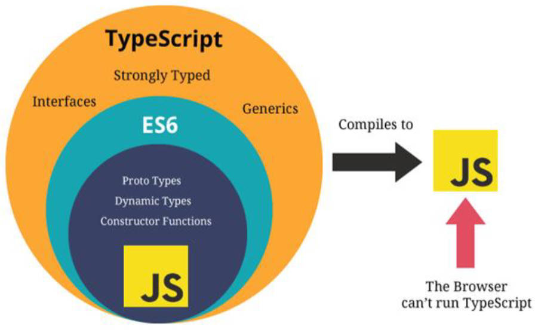

# 一、JS 的缺陷

## 1.JS 是一门优秀的语言

不可否认，JavaScript 是一门优秀的编程语言。

Stack Overflow 的创立者之一 Jeff Atwood 在 2007 年提出著名的 Atwood 定律：

- “any application that can be written in JavaScript, will eventually be written in JavaScript”。
- 即“任何可以使用 JavaScript 来实现的应用，最终都会使用 JavaScript 实现。

## 2.JS 的痛点

由于各种历史因素，JavaScript 语言本身存在很多的缺点；

- 比如 ES5 及之前，使用 `var` 关键字没有作用域的问题；

- 比如 JavaScript 最初设计的数组结构，不是连续的内存空间（浪费内存）；

- 比如直到今天 JavaScript 也没有加入类型检测这一机制；


## 3.类型缺失带来的问题

无法尽早的发现代码中的错误，比如在代码编写、编译时发现错误。

> 编程开发中我们有一个共识：错误出现的越早越好：
> - 能在编写代码的时候发现错误，就不要在代码编译时再发现（IDE 的优势就是在代码编写过程中发现错误）；
> - 能在代码编译期间发现错误，就不要在代码运行期间再发现（类型检测就可以很好的帮助我们做到这一点）；
> - 能在开发阶段发现错误，就不要在测试期间发现错误；
> - 能在测试期间发现错误，就不要在上线后发现错误。

在开发大型项目时，JavaScript 没有对函数中传入的参数类型进行验证，类似于这样的在代码中潜在的错误，只有等到运行时才能发现。

一旦当错误产生，会影响整个项目的运行，甚至崩溃。这样的项目是不安全，不健壮的。

所以我们经常会说 JavaScript 不适合开发大型项目，

加之多人员开发，相互之间没有良好的类型契约规范，JavaScript 这种宽松的类型约束机制，会带来很多安全隐患。

# 二、JS 类型约束方案选择

2014 年，Facebook 推出了 flow 来对 JavaScript 进行类型检查；

同年，Microsoft 微软也推出了 TypeScript1.0 版本；

目前来看，TypeScript 完全胜出，适用范围更广，更加流行。

# 三、TS 是什么？

## 1.官方解释

GitHub 说法：TypeScript is a superset of JavaScript that compiles to clean JavaScript output.

TypeScript 官网：TypeScript is a typed superset of JavaScript that compiles to plain JavaScript.

总结：TypeScript 是拥有类型约束的 JavaScript 超集，它可以编译成**普通、干净、完整**的 JavaScript 代码。

## 2.TS 的特性

TypeScript 是加强版的 JavaScript；

TypeScript 增加了类型约束，使 JavaScript 代码更加安全，并带来了更多好用的特性，如类似于 Java 中的枚举类型（Enum）特性、类似于 Python 中的元组类型（Tuple）。 

- TypeScript 遵从 ECMAScript 规范，JavaScript 有的特性，TypeScript 都支持，
- TypeScript 的新特性，总是保持和 ES 标准的同步，甚至是领先； 
- TypeScript 最终被编译成 JavaScript 代码，无需担心与 JavaScript 代码的兼容性问题，
- TypeScript 可借助于 Babel（使用较多）或者 TSC 工具编译成 JavaScript 代码。

## 3.TS 与 JS 的关系（图解）

TypeScript 是增加了类型约束的 JavaScript 的一个超级。



TypeScript 始于 JavaScript，归于 JavaScript。

## 4.TS 的应用 

项目源码使用 TypeScript 编写的项目：

- Angular 很早使用 TypeScript 来进行了重写，
- Vue3 也采用了 TypeScript 进行重构。
- VSCode 也是使用 TypeScript 来完成的； 
- ant-design 库（应用于 React 的 UI 库），大量使用 TypeScript 来编写； 

TypeScript 的应用范围：

- 开发 Angular 需要掌握 TypeScript；
- 开发 Vue3 项目，推荐使用 TypeScript、
- 开发 React 项目，推荐使用 TypeScript；
- 开发小程序，也支持使用 TypeScript。

# 四、大前端发展趋势怎么看待

每一样新技术的流行，必然是解决了之前技术的某一个痛点；

Vue3 使用了 TS 重构，写法上似乎更难了？—— 没有缺点的人，往往优点也很少。

# 五、TS 编译环境

TypeScript 最终会编译成 JavaScript 来运行。


搭建 TS 的编译环境，即安装 TSC 工具：

```shell
# 安装命令
npm install typescript -g

# 查看版本
tsc --version
```

# 六、TS 运行环境

## 1.手动编译&运行

两步操作：

1. 通过 tsc 编译 TypeScript 成 JavaScript 代码；

   ```shell
   tsc demo.ts # 在目录下，生成同名的 JS 文件
   ```

2. 在浏览器（需手动引入）或者 Node 环境下，运行编译生成的 JS 文件；

## 2.自动编译&运行

### 1.在浏览器环境

使用 webpack 搭建 TS 编译环境，开启一个本地服务，可以直接运行在浏览器。

1. 初始化项目，生成 package.json

   ```shell
   npm init
   ```

2. 创建 webpack.config.js

3. 配置 `entry`，`output`

4. 安装 ts-loader 和 typescript（TSC）

   ```shell
   npm install ts-loader typescript -D
   ```

5. webpack.config.js 中配置匹配规则。

6. 生成 tsconfig.josn 配置文件

   ```shell
   tsc --init
   ```

7. webpack.config.js 中使用 `resolve` 的 `extensions` 配置后缀名。默认的也要加上如`'.wasm', '.mjs', '.js', '.json'`。

8. 安装 webpack-dev-server

   ```shell
   npm install webpack-dev-server -D
   ```

9. 配置 package.josn `“serve”: "webpack serve"`，用于启动项目。

10. 安装 html-webpack-plugin，并配置插件，使用 html 模板。

    ```shell
    npm install html-webpack-plugin -D
    ```

webpack.config.js

```javascript
const path = require('path')
const HtmlWebpackPlugin = require('html-webpack-plugin')
module.exports = {
  mode: "development",
  entry: "./src/main.ts",
  output: {
    path: path.resolve(__dirname, "./dist"),
    filename: "bundle.js"
  },
  devServer: {
  },
  resolve: {
    // 需要加上后面4个默认的后缀名。
    extensions: [".ts", '.wasm', '.mjs', '.js', '.json']
  },
  module: {
    rules: [
      {
        test: /\.ts$/,
        loader: 'ts-loader'
      }
    ]
  },
  plugins: [
    new HtmlWebpackPlugin({
      template: "./index.html"
    })
  ]
}

```

### 2.在 Node 环境

使用 ts-node 库，为 TypeScript 的运行提供执行环境：

1. 安装 ts-node 库

   ```shell
   npm install ts-node -g
   ```

2. 另外 ts-node 需要依赖 tslib 和 @types/node 两个包

   ```shell
   npm install tslib @types/node -g
   ```

3. 现在，可以直接通过 ts-node 来运行 TypeScript 的代码：

   ```shell
   ts-node demo.ts
   ```

ts-node执行时，会根据全局默认配置的 `tsconfig.json ` 文件进行编译。

# 七、TS 规范约束

tslint 用于生成配置文件，规范代码。使用步骤，2步，

1. 安装 telint

   ```shell
   npm install tslint -D
   ```

2. 初始化配置文件

   ```shell
   tslint --init
   ```


# 八、TS 变量声明

变量（标识符）类型声明的完整写法：

- `var/let/const 标识符: 数据类型 = 赋值;`

声明类型后，TypeScript 就会进行类型检测，声明的类型可以称之为**类型注解**（Type Annotation）；

> 区分【类型注解】，【函数签名】，【函数调用签名】，【构造函数签名】的概念。

```typescript
let message: string = "Hello World"
message = "Hello TypeScript"

// 默认情况下，目录下的所有 TS 文件都是在同一作用域下编译的。有同名变量会报错。解决办法：文件末尾加上 `export {}`，将文件当作一个模块。
export {}
```

类型 `string` 与 `String` 的区别：

- `string`: TypeScript 给我们定义标识符时, 提供的字符串类型。

- `String`: ECMAScript 中字符串的包装类。

# 九、TS 类型推导（推断）

在开发中，并不会在声明每一个变量时，都写上对应的类型注解。

TypeScript 会在一个变量（标识符）第一次赋值时，根据赋值的类型，推导出变量（标识符）的类型：：

```typescript
let name = "zzt"
let age = 18

const height = 1.88

export {}
```

> `let` 推导出通用类型；`const` 推导出**字面量类型**。

# 十、TS 中的 string 类型

`string` 类型是字符串类型，值使用单引号或者双引号表示。

```typescript
let msg: string = 'hello'
```


# 十一、TS 中的 number 类型

TypeScript 和 JavaScript 一样，不区分整数类型（int）和浮点型（double），统一为 `number` 类型。

```typescript
let num: number = 6
```


# 十二、TS 中的 boolean 类型

`boolean` 类型只有两个取值：`true` 和 `false`，非常简单：

```typescript
let flag: boolean = true
```


# 十三、TS 中的 Array 类型

TypeScript 创建数组时，一般使用类型推导来确定类型。

使用类型注解的两种方式。

```typescript
const names1: string[] = ['abc', 'cba', 'nba'] // 推荐写法
const names2: Array<string> = ['abc', 'cba', 'nba'] // 不推荐写法，在 jsx 中解析有问题。
```

不要在一个数组中放入不同类型的元素。

# 十四、TS 中的 object 类型

声明对象中属性的类型时，一般使用类型推导，

使用类型注解时，一般使用 `type` 或 `interface` 关键字定义类型或接口。

如果使用 `object` 类型注解，表示的是**空对象**。

```typescript
const info: object = {
  name: 'zzt',
  age: 18
}
console.log(info.name) // 报错 Property 'name' does not exist on type 
```


# 十五、TS 中的 symbol 类型

TypeScript 与 JavaScript 中一样，使用 `Symbol` 来处理在对象中使用相同属性名的场景，`Symbol` 函数返回不同的值。

```typescript
const s1: symbol = Symbol('title')
const s2: symbol = Symbol('title')

const person = {
  [s1]: '程序员',
  [s2]: '学生'
}
```


# 十六、TS 中的 null 和 undefined 类型

TypeScript 中，`undefined` 和 `null`，既是实际的值，也是自己的类型。

- `null`，`undefined` 类型，分别只能赋值为 `null`，`undefined`。

标识符赋值为 `null` 或 `undefined`，那么标识符的类型推导为 `any`。

标识符赋值为 `null` ，在 TS 严格模式下，该标识符不能再赋值其它类型。

```typescript
let n: null = null
let u: undefined = undefined

// a，b 的类型推导为 any
let a = null
let b = undefined
```


# 十七、TS 中函数参数类型

TS 中，函数的参数类型，一般通过在每个参数后添加类型注解明确指定。

指定参数类型的同时，也制定了函数参数的个数。

```typescript
function sum(num1: number, num2: number) {
  return num1 + num2
}
console.log(sum(123, 321))

export {}
```


# 十八、TS 中函数返回值类型

TS 中，函数的返回值类型，一般通过自动推导。如果明确指定，阅读性更好。

```typescript
function sum(num1: number, num2: number): number {
  return num1 + num2
}
console.log(sum(123, 321))

export {}
```
