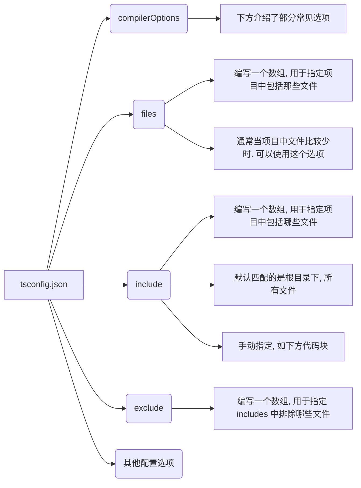

# 一、tsconfig.json 文件

## 1.是什么？

官方的说明：

当目录中出现了 `tsconfig.json` 文件，则说明该目录是 TypeScript 项目的根目录； 

`tsconfig.json` 文件指定了编译项目所需的根目录下的文件以及编译选项。

## 2.有什么用？

作用一（主要的作用）：让 TypeScript Compiler 在编译的时候，知道如何去编译 TypeScript 代码和进行类型检测； 
- 比如，是否允许不明确的 `this` 选项，是否允许隐式的 `any` 类型； 
- 比如，指定将 TypeScript 代码编译成什么版本的 JavaScript 代码；

作用二：让编辑器（如 VSCode）可以按照正确的方式识别 TypeScript 代码； 
- 更好的语法提示、静态类型检测等等；

> JavaScript 项目可以使用 `jsconfig.json` 文件，它的作用与 `tsconfig.json` 基本相同，只是默认启用了一些 JavaScript 相关的编译选项。

## 3.怎么用？

在执行 `tsc` 命令，没有其它输入文件参数时：

- 编译器将由当前目录开始向父级目录寻找包含 `tsconfig.json` 文件的目录。
- 或者可以使用 `--project`（简写 `-p`）的命令行选项来指定包含了 `tsconfig.json` 的目录；

在执行 `tsc` 命令，指定了输入文件参数时:

- `tsconfig.json` 文件会被忽略；

*webpack* 中使用 *ts-loader* 打包时，也会自动读取 `tsconfig.json` 文件，根据配置编译 TypeScript代 代码。

但是在实际开发中，我们的项目 *webpack* 环境通常会使用 *babel* 对 ts 代码进行编译。

## 4.配置

`tsconfig.json` 本身包括的选项非常多，具体可[查看文档](https://www.typescriptlang.org/tsconfig )。

使用脚手架开发项目时，选择 TypeScript 模板，`tsconfig.json` 文件一般都会配置好；

### 1.顶层选项



```json
"include": ["src/**/*", "types/**/*/d/ts"]
```

### 2.compilerOptions 常见选项

```json
// 用tsc编译时，需要的配置文件。
{
	"compilerOptions": {
		// 目标代码（ts -> js(es5/6/7/...)），实际项目开发中用的是 babel 编译，会忽略 target 选项。
		"target": "esnext",
		// 目标代码需要使用的模块化方案，‘umd’表示支持多种模块化
		"module": "esnext",
		// 使用严格模式的检查，包括隐式（模糊）的 any 类型检测等等。
		"strict": true,
    "allowJs": false,
    "noImplicitAny": true, 
		// 对 jsx 进行处理，"preserve" 表示不转化，保留所有 jsx 格式，一般 babel 会来处理；"react"，表示 tsc 会将 jsx 转成 React.createElement；
		"jsx": "preserve",
    // 导入 tslib，类似于 babel 中的 polyfill，该选项意为 让 tslib 打包一次，并在项目中引入。
    "importHelpers": true,
		// 按照 node 的模块解析规则
		"moduleResolution": "node",
		// 跳过一些库的类型检测,只检测项目中用到的类型，防止类型的命名冲突
		"skipLibCheck": true,
		// ESModule 和 Commonjs 混合使用
		"esModuleInterop": true,
    // 允许合成默认模块导出 import * as react from 'react' => import react from 'react'
		"allowSyntheticDefaultImports": true,
		"forceConsistentCasingInFileNames": true,
		"useDefineForClassFields": true,
		// 是否生成 sourcema p映射文件（ts -> js)
		"sourceMap": true,
		// 文件路径在解析时的基本 url
		"baseUrl": ".",
		// 指定具体要加载的类型，默认都会加载。
		"types": ["webpack-env", "element-plus/global"],
		// 路径解析
		"paths": {
			"@/*": ["src/*"]
		},
		// 指定在项目中可以使用哪些库的类型（如是否可以使用 Proxy/window/document）
		"lib": ["esnext", "dom", "dom.iterable", "scripthost"]
	},
	// 有哪些ts代码需要经过编译解析
	"include": ["src/**/*.ts", "src/**/*.tsx", "src/**/*.vue", "tests/**/*.ts", "tests/**/*.tsx"],
	// 排除不需要进行 ts 解析的目录。在需要解析的目录下有引用就不会解析。
	"exclude": ["node_modules"]
}
```

# 二、axios 封装

理解基本封装

- 自定义类型的使用和导入。

理解拦截器封装

理解返回值类型泛型处理

demo-project\09_TypeScript知识扩展-axios封装\src\service\request\index.ts

# 三、条件类型
泛型（类型）编程的时候，需要基于输入值的类型来决定输出值的类型。**条件类型（Conditional types）**用来描述输入类型和输出类型之间的关系。 

条件类型的写法类似于 JavaScript 中的条件表达式：”condition ? trueExpression : falseExpression“：

`SomeType extends OtherType ? TrueType : FalseType;`

```typescript
type IDType = number | string
type ResType = boolean extends IDType ? true : false // 此时 resType 为字面量类型：false
```

## 1.基本用法

这是一个函数重载案例。

```typescript
// 函数重载签名
function sum(num1: number, num2: number): number
function sum(num1: string, num2: string): string
function sum(num1, num2) {
  return num1 + num2
}
```

尝试用泛型重构。类型丢失了。

```typescript
function sum<T>(num1: T, num2: T): T
function sum(num1, num2) {
  return num1 + num2
}

const res = sum(20, 30) // 20 | 30 类型，类型丢失了。
```

使用泛型的条件类型重构，类型正确。

```typescript
function sum<T extends number|string>(num1: T, num2: T): T extends number ? number : string
function sum(num1, num2) {
  return num1 + num2
}

const res = sum(20, 30) // number 类型，类型正确。
const res2 = sum("abc", "cba") // string 类型，类型正确。
const res3 = sum(123, "cba") // 报错
```

## 2.类型推断（infer）

**在条件类型中推断（Inferring Within Conditional Types）**指的是：

使用条件类型提供的 `infer` 关键词，从条件类型中推断类型，然后在 true 分支里引用推断结果；

案例理解：

### 1.案例一：ReturnType

获取一个函数类型的返回值类型：使用内置类型工具 `ReturnType` 

#### 1.基本使用

> 【补充】：获取一个函数实例的类型，使用 “`typeof 函数实例`”

```typescript
type CalcFnType = (num1: number, num2: string) => number
function foo() {
  return "abc"
}

type CalcReturnType = ReturnType<CalcFnType> // number 类型
type FooReturnType = ReturnType<typeof foo> // string 类型
```

#### 2.自己实现

封装一个自己的工具 `MyReturnType`，实现 `ReturnType` 内置工具的效果，需要使用到 `infer` 关键词进行类型推断。

1. 使用 `type` 定义一个类型工具。

```typescript
type MyReturnType<T> = any
```

2. 为类型工具，传入一个类型参数 `T`，并对 `T` 的类型进行限制，要求必须是一个函数类型。

```typescript
type MyReturnType<T extends (...args: any[]) => void> = any
```

3. 在函数类型的返回值类型上，进行条件类型的类型推断，使用 `infer` 关键词

```typescript
type MyReturnType<T extends (...args: any[]) => void> = T extends (...args: any[]) => infer R ? R : never
```

4. 使用自己封装的类型工具 `MyReturnType`。

```typescript
type CalcFnType = (num1: number, num2: string) => number
function foo() {
  return "abc"
}

type MyReturnType<T extends (...args: any[]) => void> = T extends (...args: any[]) => infer R ? R : never

type CalcReturnType = MyReturnType<CalcFnType> // number 类型
type FooReturnType = MyReturnType<typeof foo> // string 类型
```

### 2.案例二：ParameterType

#### 1.自己实现

1. 使用 `type` 定义一个类型工具。

```typescript
type MyParameterType<T> = any
```

2. 为类型工具，传入一个类型参数 `T`，并对 `T` 的类型进行限制，要求必须是一个函数类型。

```typescript
type MyParameterType<T extends (...args: any[]) => void> = any
```

3. 在函数的参数类型上，进行条件类型的类型推断，使用 `infer` 关键词

```typescript
type MyParameterType<T extends (...args: any[]) => void> = T extends (...args: infer A) => void ? A : never
```

4. 使用自己封装的类型工具 `MyParameterType`。

```typescript
type CalcFnType = (num1: number, num2: string) => number

type MyParameterType<T extends (...args: any[]) => void> = T extends (...args: infer A) => void ? A : never

type CalcParameterType = MyParameterType<CalcFnType> // [num1: number, num2: string] 类型
```

## 3.类型分发

**分发条件类型（Distributive Conditional Types）**指的是：

当使用条件类型时，如果传入一个联合类型，就会进行分发（distributive）

案例理解，

将一个类型，转成这个类型的数组类型

#### 1.案例一：不使用分发：

定义一个类型工具 `ToArray`，传入一个联合类型，联合成员不会被分发。

```typescript
type ToArray<T> = T[]

type NumArray = ToArray<number> // number[] 类型
type NumArray = ToArray<number | string> //  (string | number)[] 类型
```

#### 2.案例二：使用分发：

定义一个类型工具 `ToArray`，传入一个联合类型，条件类型会被应用到每个联合成员，联合成员会被分发：

当传入 `string | number` 时，条件类型语句会遍历联合成员；相当于 `ToArray<string> | ToArray<number>`；所以最后的结果是：`string[] | number[]`；

```typescript
type ToArray<T> = T extends any ? T[] : never

type NumArray = ToArray<number> // number[] 类型
type NumAndStrArray = ToArray<number | string> // number[] | string[] 类型
```

# 四、内置工具

[官方文档](https://www.typescriptlang.org/docs/handbook/utility-types.html)

## 1.Partial\<Type\>

构造一个对象类型，将传入的对象类型 `T` 中的所有属性，都设置为可选类型。

### 1.基本使用

```typescript
interface IKun {
  name: string
  age: number
  slogan?: string
}

type IKunOptional = Partial<IKun>
/* type IKunOptional = {
	name?: string | undefined;
	age?: number | undefined;
	slogan?: string | undefined;
} */
```

### 2.自己实现

使用了映射类型。

> 【回顾】：`keyof` 作用于对象类型，会将其中所有属性名的字面量类型，作为联合成员，组成一个联合类型。
>
> 【补充】：`in` 关键字作用于联合类型，会遍历联合成员。

```typescript
interface IKun {
  name: string
  age: number
  slogan?: string
}

type MyPartial<T> = {
  [P in keyof T]?: T[P] 
}

type IKunOptional = MyPartial<IKun>
```

## 2.Required\<Type\>

构造一个对象类型，将传入的对象类型参数 `T` 中的所有属性，都设置为必填类型。

### 1.基本使用

```typescript
interface IKun {
  name: string
  age: number
  slogan?: string
}

type IKunRequired = Required<IKun>
/* type IKunRequired = {
	name: string;
	age: number;
	slogan: string;
} */
```

### 2.自己实现

使用了映射类型。

```typescript
interface IKun {
  name: string
  age: number
  slogan?: string
}

type MyRequired<T> = {
  [P in keyof T]-?: T[P] 
}

type IKunRequired = MyRequired<IKun>
```

## 3.ReadOnly\<Type\>

构造一个对象类型，将传入的对象类型参数 `T` 中的所有属性，都设置为只读类型。

### 1.基本使用

```typescript
interface IKun {
  name: string
  age: number
  slogan?: string
}

type IKunReadonly = Readonly<IKun>
/* type IKunReadonly = {
	readonly name: string;
	readonly age: number;
	readonly slogan?: string | undefined;
} */
```

### 2.自己实现

使用了映射类型。

```typescript
interface IKun {
  name: string
  age: number
  slogan?: string
}

type MyReadonly<T> = {
  readonly [P in keyof T]: T[P] 
}

type IKunReadonly = MyReadonly<IKun>
```

## 4.Record<Keys, Type>

用于构造一个对象类型，它所有的 键名都是 `Keys` 联合类型中的联合成员，它所有的键值都是 `Type` 类型。

### 1.基本使用

```typescript
type Address = '北京' | '上海' | '洛杉矶'
interface IKun {
  name: string
  age: number
  slogan: string
}

type IKuns = Record<Address, IKun>
/* type IKuns = {
	北京: IKun;
	上海: IKun;
	洛杉矶: IKun;
} */
```

### 2.自己实现

使用了映射类型。

> 【回顾】：`in` 关键字作用于联合类型，会遍历联合成员。
>
> 【补充】：能作为对象键名的类型，要求必须是 `string`, `number`, `symbol` 中的一个，写法 `keyof any`

```typescript
type Key = keyof any // string | number | symbol
```

对传入的 `Keys` 类型进行约束，使得它必须是一个能作为对象键名的类型，写法 `Keys extends keyof any`

```typescript
type Address = "上海" | "北京" | "洛杉矶"
interface IKun {
  name: string
  age: number
  slogan?: string
}

type MyRecord<Keys extends keyof any, T> = {
  [P in Keys]: T
}

type IKuns = MyRecord<Address, IKun>
```

## 5.Pick<Type, Keys>

用于构造一个对象类型，从 `Type` 对象类型里面挑选 `Keys` 联合类型的联合成员作为对象属性名字面量。

### 1.基本使用

```typescript
interface IKun {
  name: string
  age: number
  slogan?: string
}

type IKunPick = Pick<IKun, 'name' | 'slogan'>
/* type IKunPick = {
	name: string;
	slogan?: string | undefined;
} */
```

### 2.自己实现

使用了映射类型。

```typescript
interface IKun {
  name: string
  age: number
  slogan?: string
}

// 确实 K 一定是 T 中键名字面量类型
type ZTPick<T, K extends keyof T> = {
  [P in K]: T[P]
}

type IKuns = ZTPick<IKun, "slogan"|"name">
```

## 6.Omit<Type, Keys>

用于构造一个对象类型，从 `Type` 类型里面过滤 `Keys` 类型作为对象属性名。

### 1.基本使用

```typescript
interface IKun {
  name: string
  age: number
  slogan?: string
}

type IKunOmit = Omit<IKun, 'name'|'slogan'>
/* type IKunOmit = {
	age: number;
} */
```

### 2.自己实现

使用了映射类型，和条件类型。

> 【补充】：从联合类型 `U` 中过滤联合类型 `k` 中的联合成员，写法：`U extends K ? never : U`，
>
> - 使用到了条件类型中的联合类型的类型分发。
> - 也就是 `U` 中的联合成员，进行了**分发**。
>
> 这是，内置类型工具 `Exclude` 的作用。

```typescript
type U = 'abc' | 'cba' | 'nba'
type K = 'cba' | 'abc'

type MyExclude<U, K> = U extends K ? never : U
type R = MyExclude<U, K>
```

自己实现 `Omit` 内置类型工具：

```typescript
interface IKun {
  name: string
  age: number
  slogan?: string
}

// 确实 K 一定是 T 中键名字面量类型
type MyOmit<T, K extends keyof T> = {
  [P in keyof T as P extends K ? never: P]: T[P]
}

type IKuns = MyOmit<IKun, "name"|"slogan">
```

## 7.Exclude<UnionType, ExcludedMembers>

用于构造一个联合类型，从 `UnionType` 联合类型的联合成员中，排除了所有 `ExcludedMembers` 联合类型的联合成员。

### 1.基本使用

```typescript
type IKun = 'sing' | 'dance' | 'rap'

type IkunExclude = Exclude<IKun, 'sing' | 'rap'> // 'dance' 类型
```

### 2.自己实现

使用了条件类型，联合类型的分发

```typescript
type IKun = 'sing' | 'dance' | 'rap'

type MyExclude<U, K> = U extends K ? never : U

type IkunExclude = MyExclude<IKun, 'sing'|'rap'>
```

## 8.Extract<Type, Union>

用于构造一个联合类型，从 `Type` 联合类型里面，提取了所有 `Union` 联合类型的联合成员。

### 1.基本使用

```typescript
type IKun = 'sing' | 'dance' | 'rap'

type IkunExtract = Extract<IKun, 'sing'|'rap'|'football'> // 'sing' | 'rap' 类型
```

### 2.自己实现

使用了条件类型，联合类型的分发

```typescript
type IKun = 'sing' | 'dance' | 'rap'

type MyExtract<U, K> = U extends K ? U : never

type IkunExclude = MyExtract<IKun, 'sing'|'rap'|'football'>
```

## 9.NonNullable\<Type\>

用于构造一个联合类型，从 `Type` 中排除了 `null`、`undefined` 类型。

### 1.基本使用

```typescript
type IKun = "sing" | "dance" | "rap" | null | undefined

type IKunNonNullable = NonNullable<IKun> // "sing" | "dance" | "rap" 类型
```

### 2.自己实现

使用了条件类型，联合类型的分发

```typescript
type IKun = "sing" | "dance" | "rap" | null | undefined

type MyNonNullable<T> = T extends null|undefined ? never: T

type IKunNonNullable = MyNonNullable<IKun>
```

## 10.ReturnType\<Type\>

使用了条件类型，类型推断

[见上方【案例一：ReturnType 实现】](#1案例一：ReturnType 实现)


## 11.InstanceType\<Type\>

用于构造一个由 `Type` 的构造函数创建出来的实例的类型。

> 【补充】：`typeof [构造函数]` 拿到的是构造函数（器）的类型，而 `InstanceType<Type>` 可以拿到 `Type` 构造函数（器）创建出来的实例的类型。

### 1.基本使用

```typescript
class Person {}

type MyPerson = InstanceType<typeof Person> // Person 类型
```

常用于创建通用的实例的工具函数。

案例一：在工厂函数参数上进行类型约束，类型丢失了

```typescript
class Person {}

function factory(ctor: new (...arg: any[]) => any) {
	new ctor()
}

const p = factory(Person) // any 类型，类型丢失了
```

案例二：在工厂函数上使用泛型，并进行泛型类型约束，返回结果被推导为构造函数（器）的类型，而非构造函数（器）创建的实例的类型，类型丢失了。

```typescript
class Person {}

function factory<T extends new (...arg: any[]) => any>(ctor: T): T {
	return new ctor()
}

const p = factory(Person) // typeof Person 类型，类型丢失了
```

案例三：在工厂函数上使用泛型，并进行泛型类型约束，为工厂函数的返回值类型，使用 `InstanceType<Type>`

```typescript
class Person {}

function factory<T extends new (...args: any[]) => any>(ctor: T): InstanceType<T> {
	return new ctor()
}

const p = factory(Person) // Person 类型
```

### 2.自己实现

用到了条件类型，类型推断。

```typescript
class Person {}

type MyInstanceType<T extends new (...args: any[]) => any> = T extends new (...args: any[]) => infer R ? R : never

function factory<T extends new (...args: any[]) => any>(ctor: T): MyInstanceType<T> {
  return new ctor()
}

const p3 = factory(Person)
```


